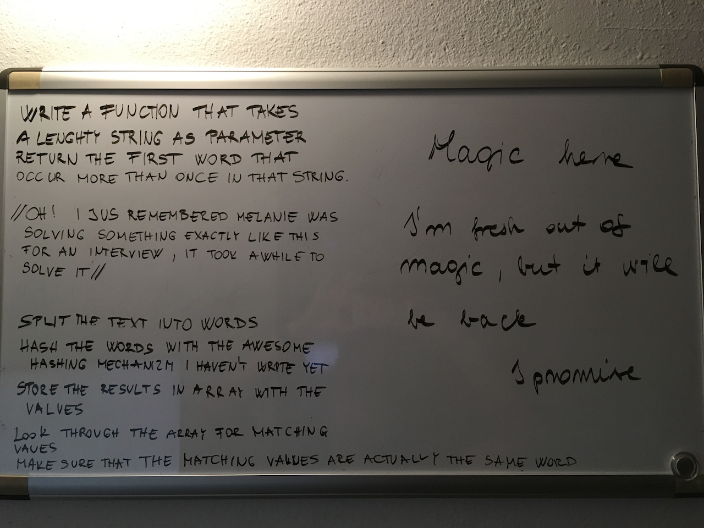

# Repeating Word
## Challenge

Write a function that accepts a lengthy string parameter.
Without utilizing any of the built-in library methods available to your language, return the first word to occur more than once in that provided string.

## Example

 - Input : "Once upon a time, there was a brave princess who..."
 - Output : "a"

## Solution

## Collaboration

