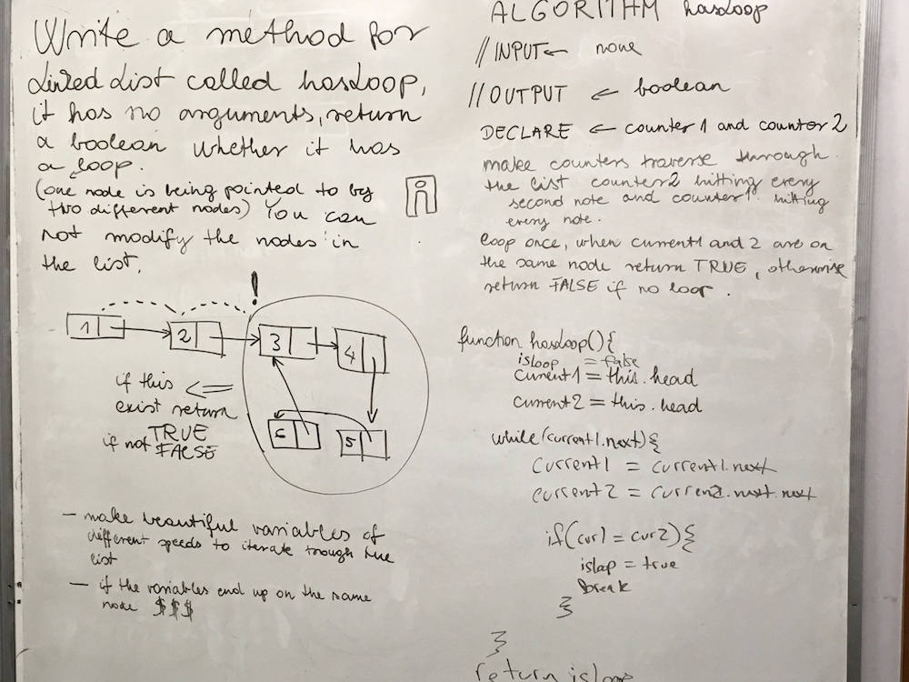

# Detect Loop
## Challenge

Write a method for the Linked List class called hasLoop which takes no arguments. Return a boolean that indicates whether or not a circular reference or loop is present in the linked list. Your implementation must not use any additional memory or modify the nodes of the linked list. You have access to the Node class and all the standard properties on the Linked List class as well as the methods created in previous challenges.
Note: Length or Size are *not* included in standard properties for a LL.

Example:

- head -> [1]-> [3]-> [2]-> X   False

- head -> [1]-> [7]-> [2]
               ↑     ↓
              [5] <-[3]         True

## Solution

## Collaboration

On this assignment we worked with Jen, Ovi and 
Jason
