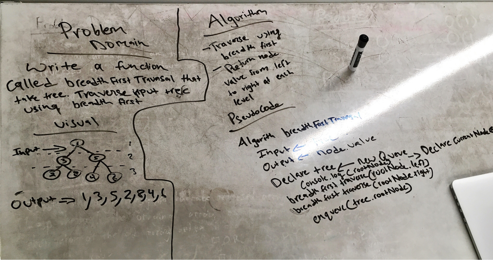

# Breath First Traverse
## Challenge

Write a function called breadthFirstTraversal which takes a Binary Tree as its unique input. Without utilizing any of the built-in methods available to your language, traverse the input tree using a Breadth-first approach; print every visited node’s value.

### Examples:

### Output 
2 7 5 2 6 9 5 11  4

## Solution

## Collaboration

On this lab, we worked with Khallil

### Acknowlegement

based on Vaidehi Joshi's explanation
