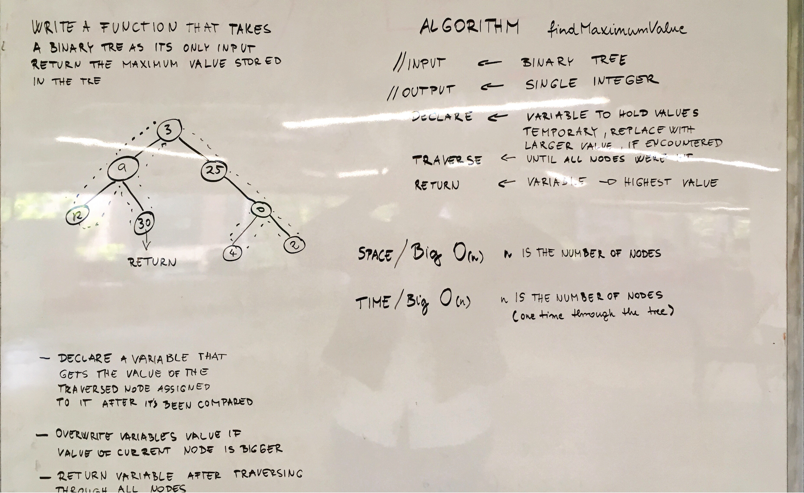

# Maximum Value in a Binatry Tree
## Challenge

Write a function called find-maximum-value which takes binary tree as its only imput. Without utilizing any of the built-in methods available to your language, return the maximum value stored in the tree. You can assume that the values stored in the Binary Tree will be numeric.

### Examples:

### Output 

11

## Solution

