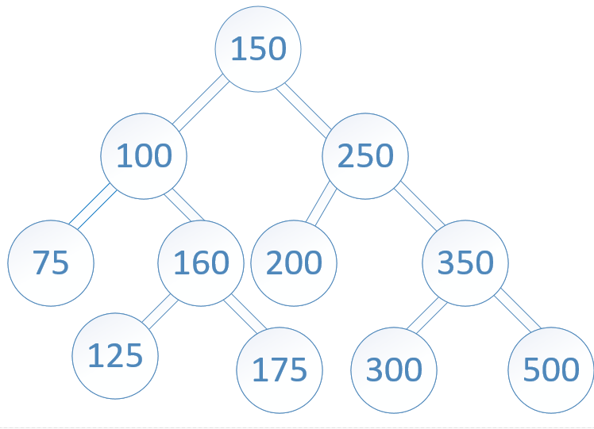

# Tree Intersection

## Challenge

Write a function called tree_intersection that takes two binary tree parameters.
Without utilizing any of the built-in library methods available to your language, return a set of values found in both trees.

Examples:

* Input:

 

* Output: [100,160,125,175,200,350,500]

## Solution

## Collaboration

A collective effort of Michael, Jen, Ovi, Jason, Khallil and me