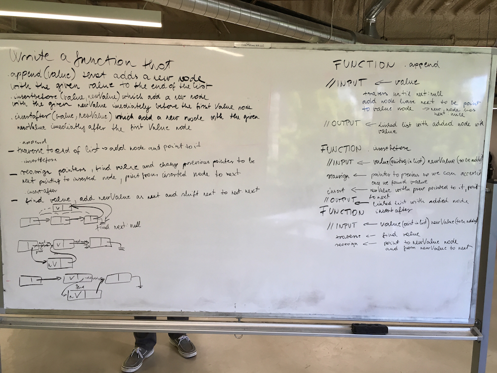
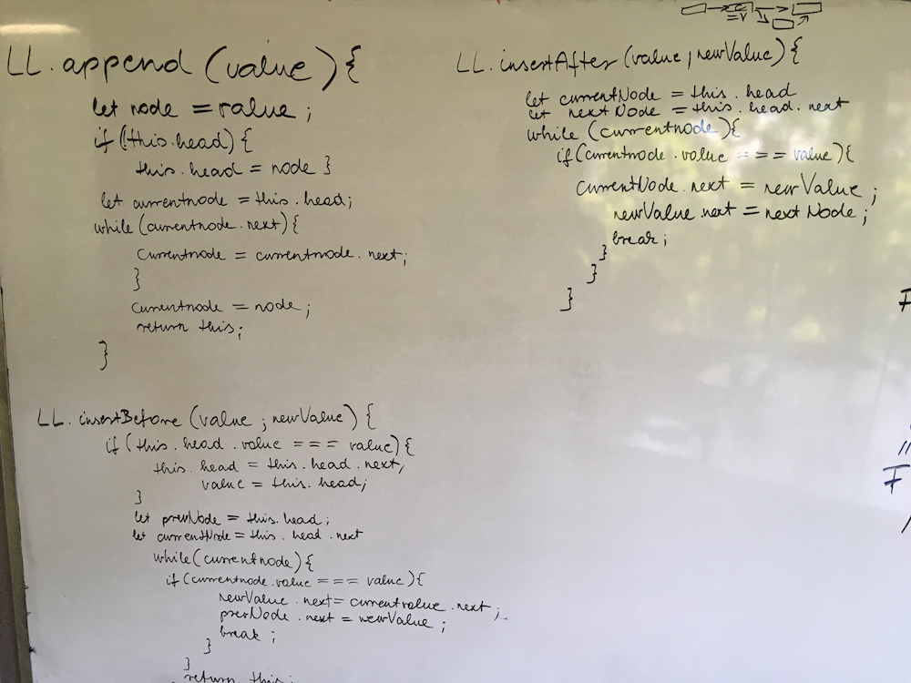

# Shift Array
## Challenge

Write the following methods for the Linked List class:

.append(value) which adds a new node with the given value to the end of the list
.insertBefore(value, newVal) which add a new node with the given newValue immediately before the first value node
.insertAfter(value, newVal) which add a new node with the given newValue immediately after the first value node

.append(value)
Input	Args	Output
head -> [1] -> [3] -> [2] -> X	5	head -> [1] -> [3] -> [2] -> [5] -> X
head -> X	1	head -> [1] -> X
.insertBefore(value, newVal)
Input	Args	Output
head -> [1] -> [3] -> [2] -> X	3, 5	head -> [1] -> [5] -> [3] -> [2] -> X
head -> [1] -> [3] -> [2] -> X	1, 5	head -> [5] -> [1] -> [3] -> [2] -> X
head -> [1] -> [2] -> [2] -> X	2, 5	head -> [1] -> [5] -> [2] -> [2] -> X
head -> [1] -> [3] -> [2] -> X	4, 5	Exception
.insertAfter(value, newVal)
Input	Args	Output
head -> [1] -> [3] -> [2] -> X	3, 5	head -> [1] -> [3] -> [5] -> [2] -> X
head -> [1] -> [3] -> [2] -> X	2, 5	head -> [1] -> [3] -> [2] -> [5] -> X
head -> [1] -> [2] -> [2] -> X	2, 5	head -> [1] -> [2] -> [5] -> [2] -> X
head -> [1] -> [3] -> [2] -> X	4, 5	Exception

## Solution

