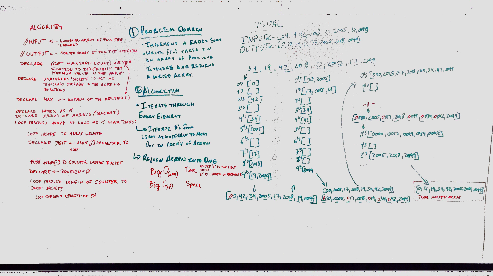

# Radix Sort

[](https://travis-ci.com/theidi267/data-structures-and-algorithms)

## Challenge

Write a function that accepts an array of positive integers, and returns an array sorted by a radix sort algorithm.

## Example

 - Input : ```[34, 19, 42, 2018, 0, 2005, 77, 2099]```
 - Output : ```[0, 19, 34, 42, 77, 2005, 2018, 2099]```


## Solution



## Collaboration

worked with Justin, Ovi and the internet
